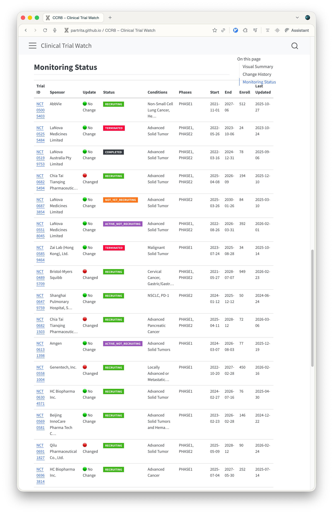

{width=80% fig-align="center"}

[clinical trial watcher](https://github.com/partrita/clinical-trial-watcher)는 Clinical trials.gov에 등재된 임상시험 정보를 분석하기 위해 개발한 파이썬 기반의 사이드 프로젝트입니다.

## 프로젝트의 활용법

`clinical trial watcher` 프로젝트는 다음과 같은 상황에서 유용하게 활용될 수 있습니다.

- 특정 타겟에 대한 임상시험 동향 파악: 특정 질병이나 유전자에 대한 최신 임상시험 동향을 빠르게 파악하고 싶을 때, 관련 임상시험들을 한눈에 확인할 수 있습니다.
- 매일 API를 통해서 변동사항이 있는지 확인합니다. 만약 한달 안에 변경 사항이 있다면 Updata의 녹색 불이 붉은 색으로 변합니다. 그리고 history에서 변동 사항이 무엇인지 알 수 있습니다.

# Repository

- [clinical trial watcher](https://github.com/partrita/clinical-trial-watcher)
