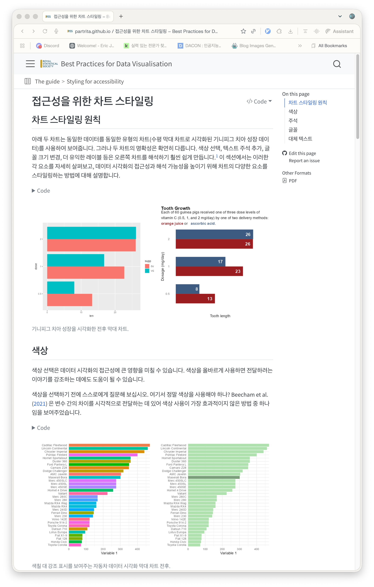

이 가이드는 데이터 시각화를 예술이자 과학으로 다루고 있어요. 영국 왕립 통계 학회 쪽 기여자들을 위해 만들어졌지만, 사실 어떤 데이터 시각화 작업에도 도움이 될 만한 내용이에요. 좋은 시각화를 만들기 위한 기본 원칙부터 차트 구조, 스타일링, 접근성, 그리고 상황에 맞는 차트 고르는 법까지 구체적인 팁과 예시를 담고 있죠. 또 여러 참고 자료를 바탕으로 만들어져 있어서, 더 깊이 배우고 싶으면 원문을 찾아보는 것도 추천해요.

- https://partrita.github.io/datavisguide/