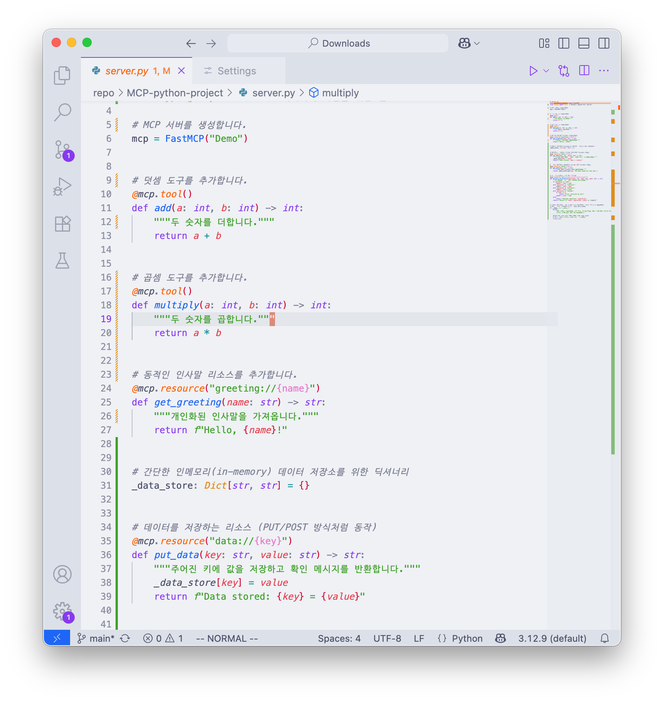
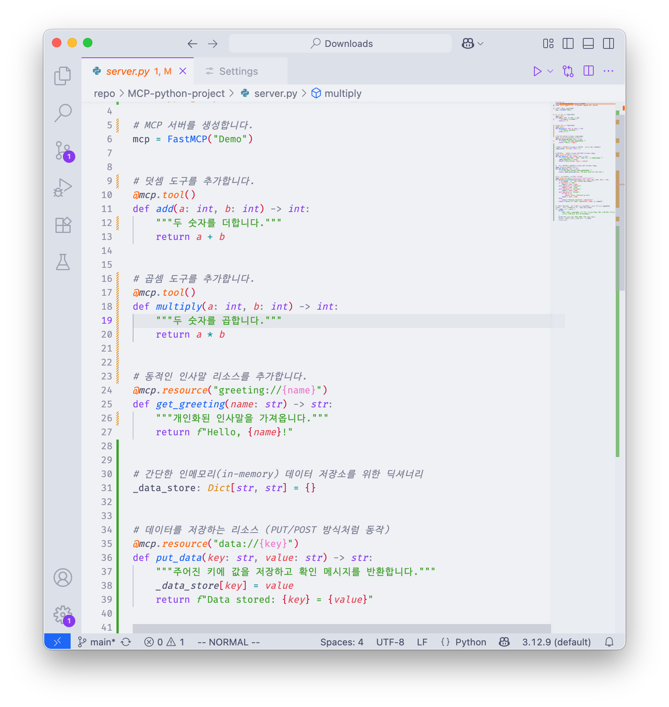
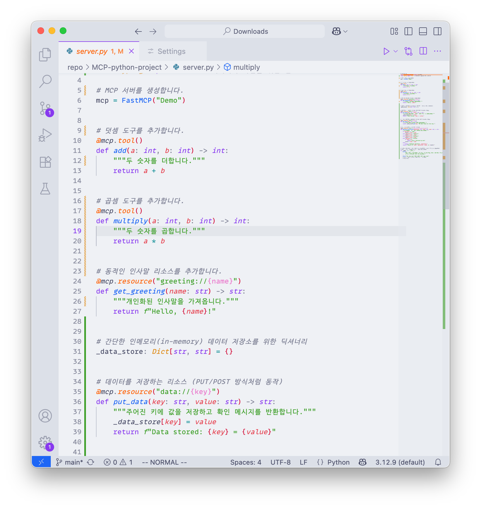

# 프로그래밍 폰트란

프로그래머가 고정폭(Monospaced) 폰트를 사용하는 이유는 코드의 가독성과 정렬을 유지하기 위함입니다. 일반적인 문서 작업에 쓰이는 가변폭(Proportional) 폰트와 달리, 고정폭 폰트는 모든 글자의 가로 길이가 동일하여 프로그래밍에 다음과 같은 장점을 제공합니다.

## 좋은 프로그래밍 폰트의 특징

좋은 프로그래밍 폰트는 단순히 고정폭이라는 점 외에도 몇 가지 중요한 특징을 가집니다.

- 명확한 문자 구분: `0`과 `O`, `1`과 `l` 같은 글자들이 혼동되지 않도록 각 문자의 고유한 형태가 뚜렷해야 합니다.
- 일관된 너비: 모든 글자의 너비가 정확하게 일치해야 합니다. 일부 폰트들은 한글과 영어를 같이 쓸 때 너비가 깨지는 경우가 있어, 여러 언어를 사용하는 환경에서는 특히 중요합니다.
- 리거쳐(Ligature) 지원: `->`, `==`, `!=` 와 같은 여러 문자가 합쳐져 하나의 기호처럼 보이는 기능을 지원하는 폰트도 있습니다. 이는 코드를 더 깔끔하고 읽기 쉽게 만들어줍니다. 대표적인 예시로는 Fira Code, JetBrains Mono 등이 있습니다.

## 왜 만들었는가?

많은 개발자들이 뛰어난 가독성을 제공하는 영문 프로그래밍 폰트를 선호합니다. 하지만 대부분의 영문 전용 폰트들은 한글을 지원하지 않아, 코드에 한글 주석이나 변수명이 섞여 있을 때 시각적 통일성이 깨지고 가독성이 떨어지는 문제가 발생합니다. 따라서 많이 사용되는 영문 프로그래밍 폰트에 네이버에서 개발한 D2Coding 폰트를 병합하는 프로젝트를 진행했습니다. 아래는 그 목록들이며 각각의 Repo에서 ttf파일을 다운로드 받을 수 있습니다. 하는 김에 Nerd font 버전도 만들어서 터미널에 사용할 버전도 같이 만들었습니다.

### Meslo + D2Coding

{width=100% fig-align="center"}

[MeD2 repository](https://github.com/partrita/MeD2) 에서 다운로드.

--- 

### Jetbrain mono + D2Coding

{width=100% fig-align="center"}

[JBD2NF repository](https://github.com/partrita/JBD2) 에서 다운로드.

---

### Fira Code + D2Coding

{width=100% fig-align="center"}

[FiraD2 repository](https://github.com/partrita/FiraD2) 에서 다운로드.

---

### MonoLisa + D2Coding

{width=100% fig-align="center"}

[MLD2 repository](https://github.com/partrita/MLD2) 에서 다운로드.

::: {.callout-warning}
현재 MLD2 저장소는 MonoLisa 상용 폰트 관련 DMCA로 접근이 차단되어 있습니다 (451 Repository access blocked).
:::

---

## 이 블로그의 고정폭 웹폰트

이 블로그의 고정폭(Monospaced) 웹폰트에는 `JBD2NF`가 사용되고 있습니다.
`JBD2NF`는 JetBrains Mono + D2Coding + Nerd Fonts를 병합한 폰트입니다.

- `styles.css`에서 `@font-face`로 `JBD2NF-Regular.woff2`를 웹폰트로 등록하고,
- `theme_light.scss` / `theme_dark.scss`에서 고정폭 폰트로 지정하고 있습니다.

```scss
$font-family-monospace: "JBD2NF", "Monaspace Neon", monospace;
```

따라서 이 블로그의 인라인 코드(`code`)와 코드 블록은 모두 `JBD2NF`로 렌더링됩니다.
지금 보고 있는 이 페이지의 아래 예시들이 바로 실제 렌더링 예시입니다.

### 렌더링 예시

인라인 코드 예시: `한글 주석 테스트 0123456789`, `0O1lI`, `->`, `==`, `!=`, `=>`, `데이터프레임 df_한글`

Nerd Font 아이콘 예시: `󰉋 src/`, ` main.py`, ` README.md`, ` main`, ` terminal`, ` 통과`, ` 실패`

```python
# JBD2NF 렌더링 예시: 한글 주석과 영문이 같은 폭으로 정렬됩니다
import pandas as pd  # 데이터 불러오기

df_한글 = pd.DataFrame({"이름": ["홍길동", "김철수"], "점수": [95, 87]})
print(df_한글)  # 출력 확인 -> 정렬 확인

# 문자 구분: 0O1lI (숫자 0, 대문자 O, 숫자 1, 소문자 l, 대문자 I)
# 리거쳐: -> == != >= <= => |> 
result = (a != b) and (x >= 10)  # 조건문 예시
```

```bash
# 터미널(Nerd Font) 예시
$ ls -la  # 파일 목록 보기
$ echo "한글 출력 테스트 1234" -> 확인

# Nerd Font 아이콘 렌더링 예시 (터미널 프롬프트 / 파일 목록)
$ eza --icons -la
󰉋 src/   main.py   README.md   config.toml
 main  clean   zsh  󰣐 archlinux
➜  tomorrow-lab  main !1 ?2  took 3s
$ git status
 main*   staged: main.py   untracked: data/   deleted: old.log
```

