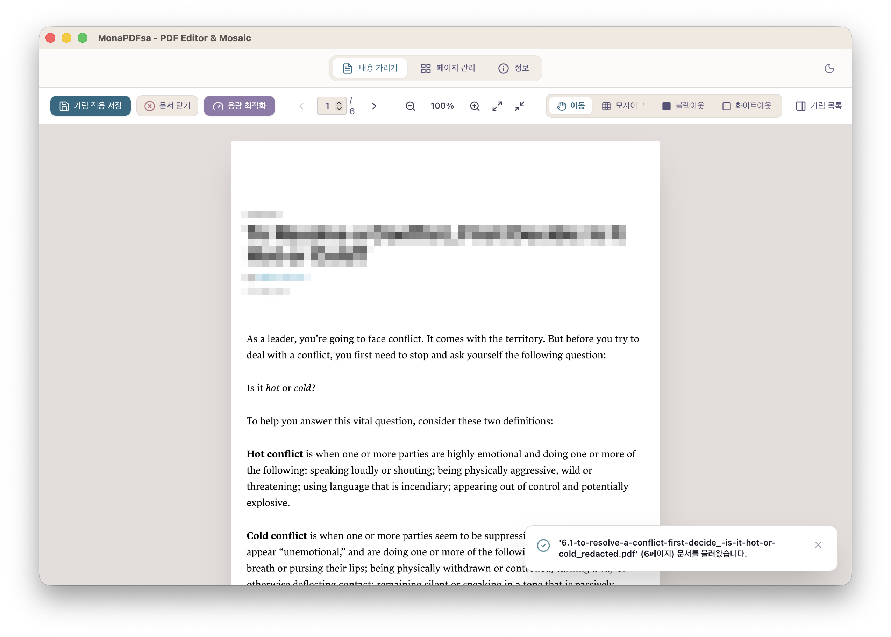
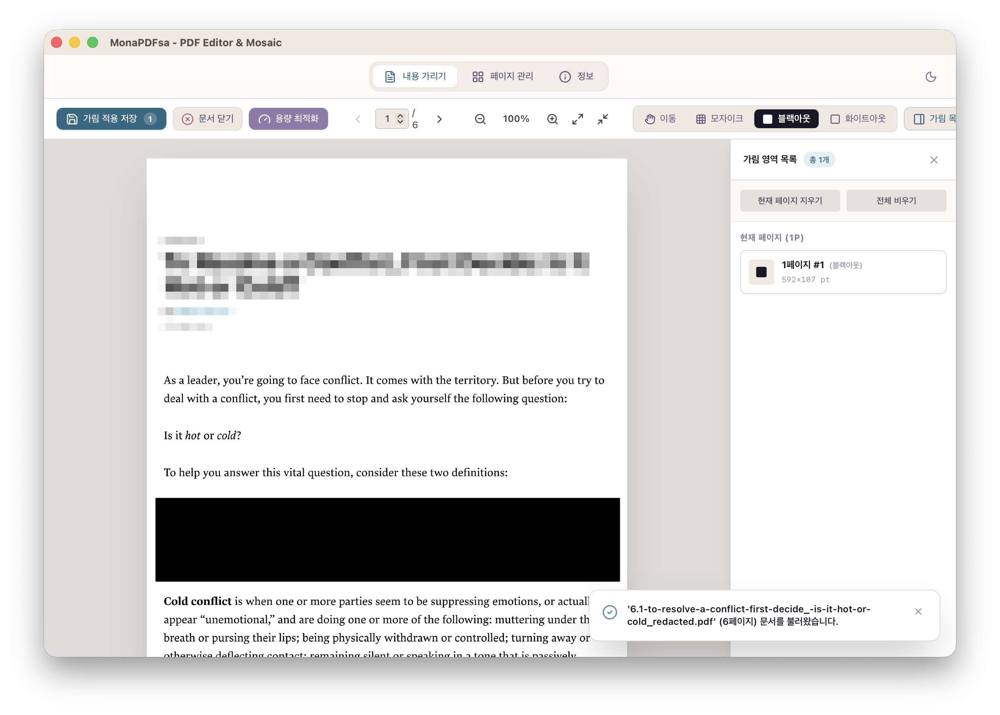
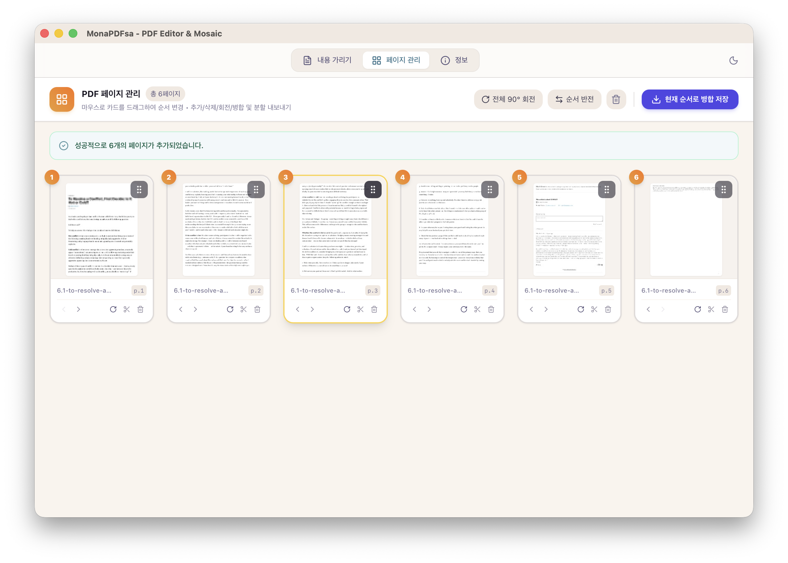
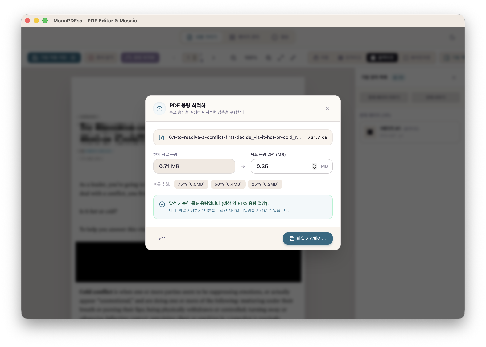

# MonaPDFsa

MonaPDFsa는 제가 필요로 하는 최소한의 기능을 가진 PDF 파일 편집기입니다. 그리고 당연히 무료입니다!

Rust의 Tauri v2와 React + TypeScript + Tailwind CSS 로 구축된 고성능 크로스플랫폼 데스크톱 PDF 뷰어, 모자이크/검열 검열 도구, 그리고 시각적 드래그 앤 드롭 PDF 페이지 정리기입니다. Windows, macOS, Linux 를 완벽하게 지원합니다.

## Screenshots

### 1. 모자이크 검열

위 그림은 모자이크 모드를 보여줍니다. 페이지에서 드래그하여 텍스트를 마스킹합니다. 상단 영역에는 픽셀 블록이 표시됩니다. 툴바를 사용하여 이동, 모자이크, 검열, 또는 흰색 처리를 선택합니다.

### 2. 검열

검은색 상자혹은 흰색 상자로 내용을 가립니다. 오른쪽 패널에는 모든 마스킹이 나열되고 페이지, 유형, 크기를 보여줍니다.
 
### 3. 페이지 관리

페이지 관리자를 보여줍니다. 각각의 페이지를 드래그하여 순서를 변경할 수 있습니다. 그리고 아이콘을 클릭해 회전, 분할 또는 삭제를 수행할 수 있습니다. 병합된 PDF 를 저장하려면 파란색 버튼을 누릅니다.

### 4. 크기 최적화

크기 최적화 도구는 목표 크기를 먼저 MB 단위로 입력하면 크기에 맞게 파일 크기를 줄입니다.

> 용량을 줄이면 품질은 물론 떨어집니다.

75%, 50%, 25% 프리셋을 제공하고 있습니다.

---

[다운로드 페이지](https://github.com/partrita/MonaPDFsa/releases)